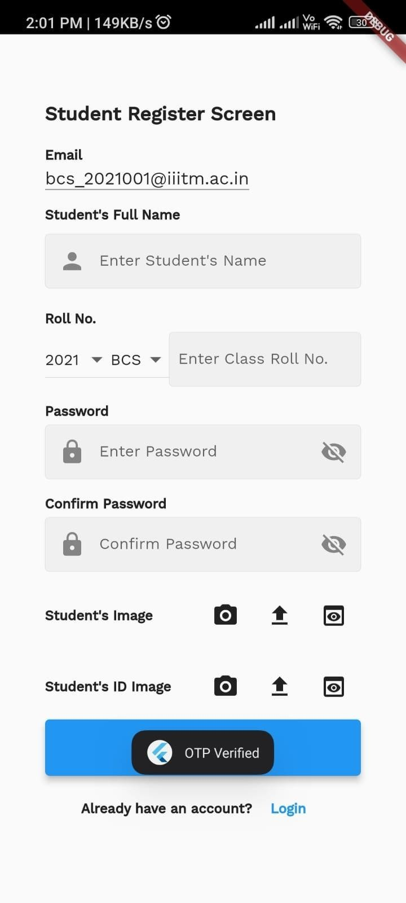
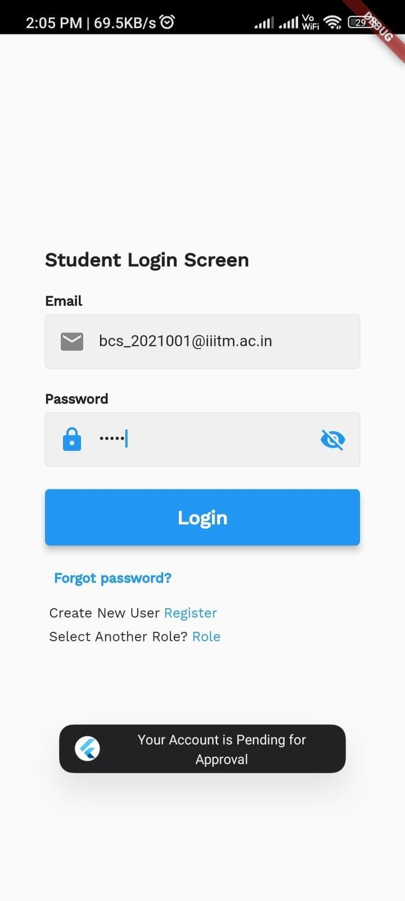

# SRAM - Student Registration and Attendance Management 📚

### Overview
SRAM is a **student registration and attendance management application** designed to streamline attendance marking and registration processes. It integrates **QR code scanning** and **face verification** technologies to enhance security and accuracy. The app includes functionalities for both students and faculty, ensuring that students can only mark their attendance when the respective faculty opens the QR code for the subject.

### Features
- **Student Registration and Login**: Secure registration and login for students.
- **Faculty Registration and Login**: Secure registration and login for faculty.
- **QR Code Attendance**: Students can scan a QR code generated by faculty to mark their attendance.
- **Face Verification**: Additional security layer with face verification for marking attendance.
- **Attendance Tracking**: Faculty can view and manage attendance records.
- **Course Management**: Faculty can manage courses and generate QR codes for attendance.
- **Profile Management**: Both students and faculty can manage their profiles.

### Screenshots
#### Registration Screen


#### Login Screen


#### QR Code Screen


#### Attendance Screen


#### Profile Screen (Student)


#### Profile Screen (Faculty)


#### Attendance List


#### Faculty Courses List


#### Student Enrolled Courses List


#### Student Stats Screen


### Technologies Used
- **Flutter**: For building the cross-platform UI.
- **Dart**: Programming language for Flutter development.
- **QR Code Generator/Scanner**: For generating and scanning QR codes.
- **Face Verification API**: For integrating face verification functionality.
- **Provider (or BLoC)**: State management.

### Installation & Setup
1. Clone the repository:
   ```bash
   git clone https://github.com/your-username/sram-app.git

2. Install Dependencies:
   ```bash
   flutter pub get

3. Run the App:
   ```bash
   flutter run

# Project Structure
- **lib/**: Contains the main application logic.
  - **component1/**: Contains the core components organized into subfolders:
    - **widgets/**: Reusable UI components like buttons, QR code scanners, profile cards.
    - **models/**: Data models such as User, Attendance, Course.
    - **providers/**: State management classes.
    - **services/**: Services for Firebase Authentication, Database, QR Code Generation/Scanning, Face Verification.
    - **screens/**: All UI screens (Registration, Login, QR Code, Attendance, Profile, etc.).
 - **component2/**: ....
 - **component3/**: ....            


# Contact
Deepak Rai  
LinkedIn: https://www.linkedin.com/in/deepak-rai-993320224/